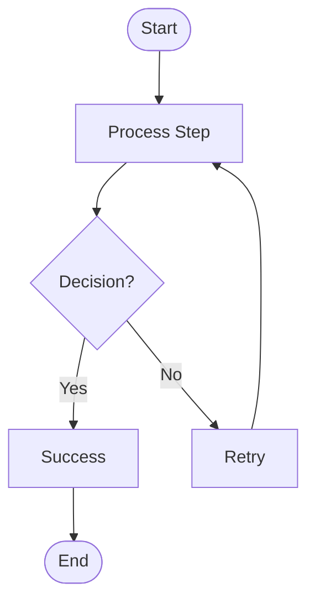

# Your Blog Post Title Here

**Introduction paragraph**: Start with a hook that draws the reader in. Explain what problem you're solving or what you'll teach them. Keep it concise and clear.

## Section 1: Background

Provide context for your topic. What's the problem? Why does it matter?

### Subsection Example

You can use subsections to break down complex topics.

- Bullet points work great for lists
- They help readers scan content quickly
- Keep them concise

## Section 2: The Solution

Explain your approach or solution. Use code examples where relevant:

```javascript
// Code example with syntax highlighting
function example() {
  console.log("This will be syntax highlighted");
  return true;
}
```

You can also use inline code like `const variable = value` for small snippets.

## Section 3: Implementation Details

### Step 1: First Step

Explain each step clearly. Use numbered lists for sequential processes:

1. First, do this
2. Then, do that
3. Finally, verify the result

### Step 2: Next Step

**Important tip**: Use bold text to highlight key points or warnings.

*Emphasis*: Use italics for subtle emphasis.

## Section 4: Results and Impact

Show the outcomes of your approach. Use metrics if you have them:

- **Metric 1**: Improved by 85%
- **Metric 2**: Reduced from 40 min to 15 min
- **Metric 3**: Saved 42% in resource usage

## Diagrams (Optional)

If you need flowcharts or diagrams, you can use Mermaid.js:



## Best Practices

Share lessons learned or best practices:

1. **Practice 1**: Explanation of why this is important
2. **Practice 2**: Another key takeaway
3. **Practice 3**: Final recommendation

## Common Pitfalls

Warn readers about common mistakes:

- **Pitfall 1**: What to avoid and why
- **Pitfall 2**: Another common mistake
- **Pitfall 3**: How to prevent issues

## Conclusion

Summarize your main points. Reinforce the key takeaways. Provide a call-to-action if appropriate (e.g., "Try this approach in your next project").

## Additional Resources

- [Link to related article](https://example.com)
- [Documentation](https://example.com/docs)
- [GitHub repository](https://github.com/example/repo)

---

**Note**: This is an example post template. Replace all content with your actual blog post content. Make sure to:

1. Update all frontmatter fields with your actual values
2. Use proper ISO 8601 UTC date format: `YYYY-MM-DDTHH:mm:ssZ`
3. Choose 3-6 focused tags
4. Write a compelling 50-300 character excerpt
5. Use a unique slug (lowercase letters, numbers, hyphens only)
6. Include practical examples and code where relevant
7. Add images if they enhance understanding
8. Proofread for grammar and clarity
